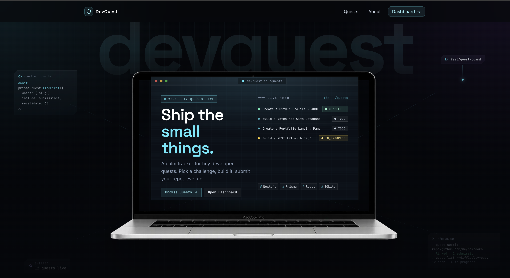

# DevQuest

> **Live demo →** [https://dev-quest-one.vercel.app/](https://dev-quest-one.vercel.app/)

A full-stack developer quest tracker built with Next.js .

Browse developer challenges, submit your GitHub work, manage quests from a dashboard, bookmark quests for later, and track submissions — all in one small, readable codebase that demonstrates the core Next.js concepts from class.



---

## Project Overview

DevQuest is a quest board for developers. You can:

- Browse a public list of developer challenges (quests)
- View quest details and submit your GitHub work
- Create, edit, and delete quests from a protected dashboard
- Update quest status inline (TODO → IN PROGRESS → COMPLETED)
- Bookmark quests you want to revisit
- View all submissions across all quests

The app intentionally stays small and focused. Every Next.js concept is used where it actually makes sense, not just for the sake of it.

---

## Tech Stack

| Layer        | Choice                                                |
| ------------ | ----------------------------------------------------- |
| Framework    | Next.js 16.2.7 (App Router)                           |
| Language     | TypeScript                                            |
| Styling      | Tailwind CSS v4 (glassmorphism dark UI)               |
| ORM          | Prisma 6                                              |
| Database     | PostgreSQL on [Neon](https://neon.tech) (serverless)  |
| Hosting      | [Vercel](https://vercel.com)                          |
| Runtime      | React 19, Node.js                                     |

---

## Features Implemented

- Public quest board with featured quests on the home page
- Quest detail page with a GitHub submission form
- Bookmark toggle (add / remove) on quest detail pages
- Dashboard overview with live stats (quests, submissions, bookmarks)
- Manage quests: create, edit, delete, change status inline
- Submission log with timestamps and linked quest titles
- Shared validation helpers used by both API Routes and Server Actions
- Structured API responses (`success`, `message`, `data`, `error`) across all routes
- `notFound()` for missing records, duplicate-slug handling, meaningful error messages

---

## How to Run Locally

```bash
# 1. Clone the repository
git clone <your-repo-url>
cd devquest

# 2. Install dependencies
npm install

# 3. Create your local environment file
cp .env.example .env

# 4. Generate the Prisma client
npx prisma generate

# 5. Push the schema to the local SQLite database
npm run db:push

# 6. Seed demo data (8 quests + sample submission + bookmark)
npm run db:seed

# 7. Start the development server
npm run dev
```

Open [http://localhost:3000](http://localhost:3000).

---

## npm Scripts

| Script              | What it does                                        |
| ------------------- | --------------------------------------------------- |
| `npm run dev`       | Start the Next.js development server                |
| `npm run build`     | Production build                                    |
| `npm run start`     | Start the production server                         |
| `npm run lint`      | Run ESLint                                          |
| `npm run db:push`   | Push the Prisma schema to the local SQLite database |
| `npm run db:seed`   | Reset and reseed demo data via `prisma/seed.ts`     |
| `npm run db:studio` | Open Prisma Studio to browse data visually          |

---

## Environment Variables

Create a `.env` file based on `.env.example`:

```env
DATABASE_URL="file:./dev.db"
```

The SQLite database file lives at `prisma/dev.db` and is created automatically after running `db:push`.

---

## Database Setup

Schema lives in `prisma/schema.prisma`. Three models:

| Model        | Fields                                                                 |
| ------------ | ---------------------------------------------------------------------- |
| `Quest`      | id, title, slug (unique), description, difficulty, category, status, isFeatured, createdAt, updatedAt |
| `Submission` | id, questId (FK), name, githubUrl, notes, createdAt                    |
| `Bookmark`   | id, questId (FK), createdAt                                            |

Enums: `QuestStatus` (`TODO` | `IN_PROGRESS` | `COMPLETED`), `Difficulty` (`BEGINNER` | `INTERMEDIATE` | `ADVANCED`).

The seed file (`prisma/seed.ts`) safely clears existing data and inserts 8 realistic quests, one sample submission, and one bookmark.

---

## Routes and Pages

File-based routing under `app/`. Rendering mode is set via `export const dynamic` or `export const revalidate` in each page file.

| Path                              | Purpose                          | Rendering               |
| --------------------------------- | -------------------------------- | ----------------------- |
| `/`                               | Home — hero + featured quests    | ISR (`revalidate = 60`) |
| `/quests`                         | Public quest board               | ISR (`revalidate = 60`) |
| `/quests/[slug]`                  | Quest detail + submission form   | ISR + `generateStaticParams` |
| `/about`                          | Project documentation            | SSG (`force-static`)    |
| `/dashboard`                      | Quest Log overview with stats    | SSR (`force-dynamic`)   |
| `/dashboard/quests`               | Manage all quests                | SSR (`force-dynamic`)   |
| `/dashboard/quests/new`           | Create a new quest               | SSR + Server Action     |
| `/dashboard/quests/[id]/edit`     | Edit an existing quest           | SSR (`force-dynamic`)   |
| `/dashboard/submissions`          | All submissions                  | SSR (`force-dynamic`)   |

---

## API Routes

All under `app/api/**/route.ts`. Every response uses the same structured shape and correct HTTP status codes (`200`, `201`, `400`, `404`, `409`, `500`).

| Method   | Path                  | Description                            |
| -------- | --------------------- | -------------------------------------- |
| `GET`    | `/api/quests`         | List all quests (with submission count)|
| `POST`   | `/api/quests`         | Create a quest                         |
| `GET`    | `/api/quests/[id]`    | Get a single quest by id               |
| `PATCH`  | `/api/quests/[id]`    | Update a quest by id                   |
| `DELETE` | `/api/quests/[id]`    | Delete a quest by id                   |
| `GET`    | `/api/submissions`    | List all submissions                   |
| `POST`   | `/api/submissions`    | Create a submission                    |
| `GET`    | `/api/bookmarks`      | List all bookmarks                     |
| `POST`   | `/api/bookmarks`      | Add a bookmark                         |
| `DELETE` | `/api/bookmarks`      | Remove a bookmark by `questId`         |

**Success response shape:**

```json
{
  "success": true,
  "message": "Quest fetched successfully",
  "data": {}
}
```

**Error response shape:**

```json
{
  "success": false,
  "message": "Validation failed",
  "error": "Title is required"
}
```

---

## Server Actions

Defined in `app/actions/quest-actions.ts` with `"use server"` at the top. They accept `FormData` from Next.js forms, validate input, write to the database, and call `revalidatePath` / `redirect` to keep the UI in sync.

| Action                    | Where it's used                                      |
| ------------------------- | ---------------------------------------------------- |
| `createQuestAction`       | Create quest form (`/dashboard/quests/new`)          |
| `updateQuestAction`       | Edit quest form (`/dashboard/quests/[id]/edit`)      |
| `updateQuestStatusAction` | Inline status dropdown on the manage quests page     |
| `deleteQuestAction`       | Delete button on the manage quests page              |
| `createSubmissionAction`  | Submission form on the public quest detail page      |
| `bookmarkQuestAction`     | Bookmark button on the quest detail page             |
| `deleteBookmarkAction`    | Unbookmark button on the quest detail page           |

Each action returns a typed `ActionState`:

```ts
type ActionState = {
  ok: boolean;
  message: string;
  fieldErrors?: Record<string, string>;
};
```

Client components use `useActionState` to surface field errors and a pending state, and `useFormStatus` inside `<SubmitButton />` to disable the button while a submission is in flight.

---

## Rendering Strategies

### SSG — Static Site Generation

**Where:** `/about`

**Why:** The about page is static documentation. It has no database data and never changes at runtime. `export const dynamic = "force-static"` tells Next.js to render it once at build time.

### ISR — Incremental Static Regeneration

**Where:** `/` (home), `/quests` (quest board), `/quests/[slug]` (quest detail)

**Why:** Public pages benefit from caching — they don't need to hit the database on every request. `export const revalidate = 60` regenerates the cached page in the background every 60 seconds. The quest detail page also uses `generateStaticParams()` to pre-build known slugs at build time while still serving new slugs on demand.

### SSR — Server-Side Rendering

**Where:** All dashboard pages (`/dashboard`, `/dashboard/quests`, `/dashboard/quests/[id]/edit`, `/dashboard/submissions`)

**Why:** The dashboard must always show the latest data. Caching a manager view would show stale quest statuses, submission counts, and bookmarks. `export const dynamic = "force-dynamic"` forces a fresh database read on every request.

---

## API Routes vs Server Actions

Both are used in this project, and they serve different purposes.

**API Routes** (`app/api/**/route.ts`) handle external or programmatic CRUD. They accept HTTP requests from any client (browser fetch, Postman, a mobile app) and return structured JSON. They are the right choice when data needs to be accessible outside the Next.js UI.

**Server Actions** (`app/actions/quest-actions.ts`) handle form mutations inside the UI. They are called directly by `<form action={...}>` elements in React. Because they run on the server, they can access the database directly and call `revalidatePath` and `redirect` — no `fetch` call or JSON parsing needed on the client.

The same validation helpers in `lib/validations.ts` are shared by both, keeping the logic DRY.

---

## Project Structure

```
app/
  layout.tsx                          # Root layout + global metadata
  page.tsx                            # Home page (ISR)
  globals.css

  about/
    page.tsx                          # About page (SSG)

  quests/
    page.tsx                          # Public quest board (ISR)
    [slug]/
      page.tsx                        # Quest detail (ISR + generateStaticParams)
      submission-form.tsx             # Client form — useActionState
      bookmark-controls.tsx           # Client bookmark toggle

  dashboard/
    layout.tsx                        # Dashboard shell + sidebar
    page.tsx                          # Overview stats (SSR)
    quests/
      page.tsx                        # Manage quests table (SSR)
      quest-row-actions.tsx           # Client: status dropdown + edit + delete
      new/page.tsx                    # Create quest page
      [id]/edit/page.tsx              # Edit quest page (SSR)
    submissions/
      page.tsx                        # All submissions (SSR)

  actions/
    quest-actions.ts                  # "use server" — all Server Actions

  api/
    quests/route.ts                   # GET, POST
    quests/[id]/route.ts              # GET, PATCH, DELETE
    submissions/route.ts              # GET, POST
    bookmarks/route.ts                # GET, POST, DELETE

components/
  glass-card.tsx                      # Reusable glass surface
  page-shell.tsx                      # Centered max-width container
  section-heading.tsx                 # Page title + subtitle + optional actions
  site-header.tsx                     # Public navigation + footer shell
  site-footer.tsx                     # Public footer
  dashboard-sidebar.tsx               # Dashboard sidebar (Client Component)
  quest-card.tsx                      # Quest card used on home + board
  quest-form.tsx                      # Create/edit form (Client Component)
  status-badge.tsx                    # TODO / IN_PROGRESS / COMPLETED pill
  difficulty-badge.tsx                # BEGINNER / INTERMEDIATE / ADVANCED pill
  stat-card.tsx                       # Dashboard stat tiles
  empty-state.tsx                     # Reusable empty state with optional CTA
  submit-button.tsx                   # useFormStatus submit button
  form-field.tsx                      # Labeled text input
  textarea-field.tsx                  # Labeled textarea

lib/
  prisma.ts                           # Prisma client singleton
  slugify.ts                          # title → URL slug
  api-response.ts                     # successResponse / errorResponse helpers
  validations.ts                      # Shared validators (required, isValidUrl, enums)
  format-date.ts                      # Date formatters

prisma/
  schema.prisma                       # Quest, Submission, Bookmark models
  seed.ts                             # Resets and seeds demo data
  dev.db                              # Local SQLite database (git-ignored)

.env.example                          # Environment variable template
```

---

## Concepts Covered from Class

| Concept                          | Where in this project                                         |
| -------------------------------- | ------------------------------------------------------------- |
| Next.js App Router setup         | `app/` directory, `next.config.ts`                           |
| File-based routing               | Every file under `app/` is a route                           |
| Layouts (root + nested)          | `app/layout.tsx` and `app/dashboard/layout.tsx`              |
| Multiple pages and routes        | 9 pages, 10 API endpoints                                    |
| SSR                              | All dashboard pages (`force-dynamic`)                        |
| SSG                              | `/about` (`force-static`)                                    |
| ISR                              | `/`, `/quests`, `/quests/[slug]` (`revalidate = 60`)         |
| `generateStaticParams`           | Pre-builds known quest slugs at build time                   |
| API Route Handlers               | `app/api/**/route.ts`                                        |
| GET, POST, PATCH, DELETE         | Fully covered across the quest, submission, bookmark routes  |
| Database connection              | Prisma singleton in `lib/prisma.ts`                          |
| Structured API responses         | `lib/api-response.ts` used across all route handlers         |
| Proper error handling            | Validation errors, 404s, 409 conflicts, 500 fallbacks        |
| Server Actions (`"use server"`)  | `app/actions/quest-actions.ts`                               |
| `useActionState`                 | `submission-form.tsx`, `bookmark-controls.tsx`, `quest-form.tsx` |
| `useFormStatus`                  | `components/submit-button.tsx`                               |
| `revalidatePath` + `redirect`    | After every mutation in Server Actions                       |
| `notFound()`                     | Quest detail and edit pages when a record is missing         |
| Server vs Client Components      | Server by default; Client only where state or browser APIs are needed |

---

## Assumptions and Limitations

- No authentication. The dashboard is open and unprotected.
- The bookmark feature has no per-user isolation — bookmarks are global.
- Submissions are plain text and are not moderated.
- The project uses SQLite for simplicity. Swap `provider` in `prisma/schema.prisma` to `postgresql` for a production deployment.
- The project is built for assignment evaluation and learning, not production traffic.

---

## Why This Project Satisfies the Assignment

- Uses **Next.js App Router** with file-based routing and two nested layouts
- Implements **SSR**, **SSG**, and **ISR** on different pages, each with a clear and documented reason
- Covers **GET**, **POST**, **PATCH**, and **DELETE** across the API routes
- Connects to a **real SQLite database via Prisma** with full CRUD operations
- Returns **structured `{ success, message, data, error }` responses** from every API route
- Handles errors meaningfully: field-level validation, duplicate slug detection, `notFound()`, and 500 fallbacks
- Uses **Server Actions** with `"use server"` for all UI form mutations
- Clearly separates **API Routes** (external CRUD) from **Server Actions** (UI form mutations) — both coexist and share validation logic
- Code is organized, readable, and avoids repeated logic through shared helpers and components
- Includes `.env.example`, a complete README, and working seed data
